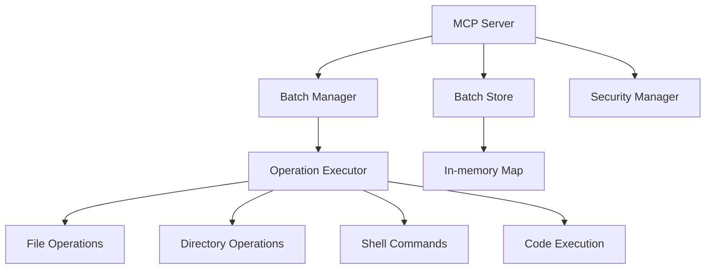

# Piano per l'implementazione del server MCP CodeAct

## Comprensione del problema

Il problema attuale con i tool MCP esistenti è che costringono l'LLM a eseguire operazioni singole e sequenziali, creando un loop inefficiente con latenza elevata. La soluzione proposta introduce due tool principali che permettono l'esecuzione di batch di operazioni, consentendo all'LLM di continuare a ragionare mentre il sistema esegue le operazioni in background.

## Architettura proposta



## Componenti principali

1. **Server MCP Core**:
   - Registrazione dei tool (`batch_execute`, `await`)
   - Gestione delle richieste
   - Configurazione e sicurezza

2. **Batch Manager**:
   - Creazione e tracciamento dei batch
   - Gestione dello stato dei batch
   - Parallelizzazione delle operazioni indipendenti

3. **Operation Executor**:
   - Esecuzione delle diverse tipologie di operazioni
   - Gestione degli errori
   - Isolamento dei processi (sicurezza)

4. **Batch Store**:
   - Memorizzazione dello stato dei batch attivi
   - Pulizia automatica dei batch completati

## Struttura delle directory

```
src/
├── index.ts              # Entry point
├── server.ts             # Server MCP core
├── types/                # Type definitions
│   ├── batch.ts
│   ├── operations.ts
│   └── security.ts
├── batch/                # Batch management
│   ├── manager.ts
│   ├── store.ts
│   └── executor.ts
├── operations/           # Operation implementations
│   ├── file.ts
│   ├── directory.ts
│   ├── shell.ts
│   └── code.ts
├── security/             # Security implementations
│   ├── manager.ts
│   ├── isolation.ts
│   └── limits.ts
└── utils/                # Utility functions
    ├── logger.ts
    └── helpers.ts
```

## Implementazione dei tool

### 1. batch_execute

Questo tool accetta un array di operazioni e le esegue in modo sincrono o asincrono:

```typescript
{
  name: "batch_execute",
  schema: {
    operations: Array<Operation>,
    sync?: boolean,        // Default: false (async)
    workdir?: string       // Working directory
  },
  returns: {
    // Se sync=true
    results?: Array<OperationResult>,
    
    // Se sync=false  
    batch_id?: string,
    status?: 'queued' | 'running'
  }
}
```

### 2. await

Questo tool verifica lo stato di un batch o attende il suo completamento:

```typescript
{
  name: "await",
  schema: { 
    batch_id: string,
    timeout?: number  // ms, undefined = wait infinito
  },
  returns: {
    status: 'completed' | 'failed' | 'running' | 'timeout',
    results?: Array<OperationResult>,
    operations_completed: number,
    operations_total: number
  }
}
```

## Sicurezza

Implementeremo il Level 1 (Process Isolation) come default per l'MVP:
- Job Objects su Windows, cgroups su Linux
- Limiti memoria/CPU
- Filesystem sandbox
- Zero overhead, sicurezza base

## Piano di sviluppo

1. **Fase 1**: Implementazione base
   - Struttura del progetto
   - Definizioni dei tipi
   - Implementazione del server MCP core

2. **Fase 2**: Implementazione batch e operazioni
   - Batch manager e store
   - Esecuzione operazioni (file, directory, shell, code)
   - Gestione errori

3. **Fase 3**: Sicurezza e testing
   - Implementazione sicurezza base
   - Test delle funzionalità
   - Documentazione
